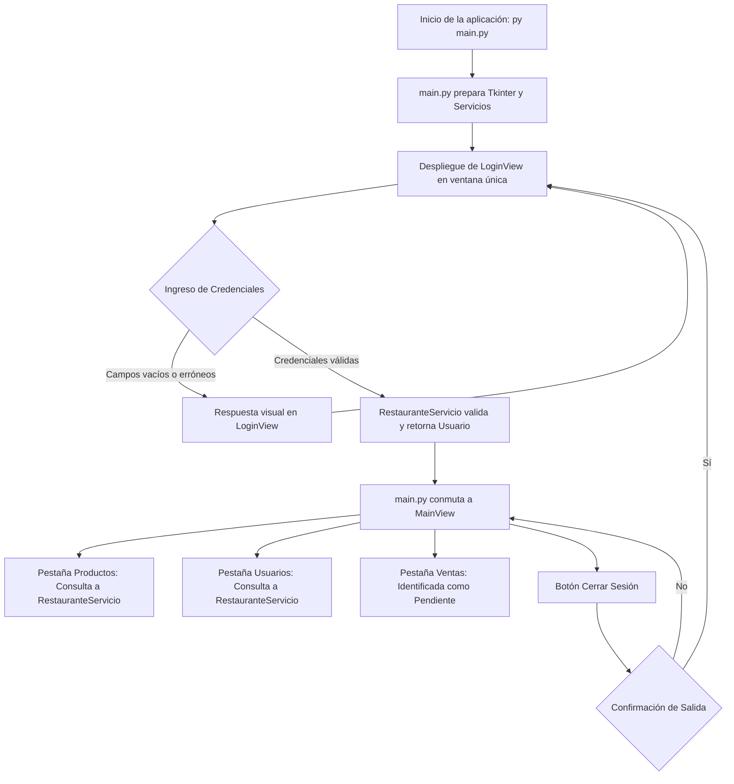

# Sistema de Restaurante Gourmet — Semana 13
## Introducción a Interfaces Gráficas con Tkinter y Arquitectura Modular en Capas

**Asignatura:** Programación Orientada a Objetos  
**Carrera:** Ingeniería en Tecnologías de la Información  
**Universidad:** Universidad Estatal Amazónica (UEA)  
**Estudiante:** Lilibeth Demera  
**Período Académico:** Segundo Semestre  

---

## 1. Introducción y Contexto

En esta **Semana 13**, se da inicio a la incorporación de **interfaces gráficas de usuario (GUI)** utilizando la biblioteca estándar **Tkinter** de Python. Tomando como fundamento el patrón estructural del repositorio docente (*Biblioteca App*), el proyecto traslada las entidades y lógica al dominio de un **Restaurante**.

### Principios Fundamentales Aplicados
1. **Separación de Responsabilidades:** No se concentra la aplicación en un solo archivo. Se organiza en paquetes con roles específicos: `modelos/` para entidades, `servicios/` para la lógica y persistencia, `ui/` para las vistas y `main.py` como orquestador.
2. **Desacoplamiento de las Vistas:** La capa `ui/` (`LoginView`, `MainView`) **nunca** lee ni manipula directamente los archivos JSON. Toda solicitud de información o validación se realiza a través de `RestauranteServicio`.
3. **Ventana Única de Tkinter:** Tanto el acceso como el panel principal coexisten dentro de una **única ventana raíz (`tk.Tk`)**, alternando los marcos (`Frame`) de forma fluida y destruyendo de manera limpia la vista previa para optimizar memoria.
4. **Base Gráfica Progresiva:** En esta semana se establece una base gráfica limpia y simplificada con **productos** y **usuarios**, dejando módulos complejos como **Ventas** claramente señalizados como funcionalidades pendientes que se integrarán progresivamente en las próximas semanas.

---

## 2. Estructura Obligatoria del Proyecto

```text
restaurante_app/
├── datos/
│   ├── productos.json          # Datos locales persistentes del catálogo
│   └── usuarios.json           # Datos locales de usuarios y credenciales de acceso
├── modelos/
│   ├── __init__.py             # Exporta los modelos del dominio
│   ├── producto.py             # Clase Producto (código, nombre, categoría, precio, stock)
│   └── usuario.py              # Clase Usuario (identificación, nombre, correo, clave)
├── servicios/
│   ├── __init__.py             # Exporta los servicios de persistencia y negocio
│   ├── archivo_servicio.py     # Manejo exclusivo de lectura de archivos JSON con excepciones
│   └── restaurante_servicio.py # Lógica de negocio: validación de acceso y consultas
├── ui/
│   ├── __init__.py             # Exporta las vistas gráficas
│   ├── login_view.py           # Pantalla de inicio de sesión con validaciones visuales
│   └── main_view.py            # Panel principal con pestañas (Productos, Usuarios, Ventas)
├── main.py                     # Ventana raíz, preparación de servicios y control de navegación
└── README.md                   # Documentación técnica y pedagógica del proyecto
```

---

## 3. Descripción Detallada de los Componentes

### 3.1. Capa de Modelos (`modelos/`)
* **`Producto` ([producto.py](file:///modelos/producto.py)):**
  - Representa los platos y bebidas ofrecidos por el restaurante.
  - Incorpora encapsulación rigurosa con `@property` y setters que validan: código no vacío, nombre no vacío, categoría no vacía, precio positivo ($> 0$) y stock no negativo ($\ge 0$).
  - Provee serialización y deserialización bidireccional (`to_dict()` y `from_dict()`).
* **`Usuario` ([usuario.py](file:///modelos/usuario.py)):**
  - Representa los usuarios registrados en el sistema utilizados para la simulación de autenticación y consulta.
  - Valida formato de correo electrónico (`@`), identificación y contraseña de acceso.
  - Incluye el método `validar_credencial(clave_ingresada)` para cotejar la autenticidad sin exponer directamente el atributo privado.

### 3.2. Capa de Servicios (`servicios/`)
* **`ArchivoServicio` ([archivo_servicio.py](file:///servicios/archivo_servicio.py)):**
  - Mantiene la responsabilidad exclusiva de interactuar con el almacenamiento en disco local (lectura de `productos.json` y `usuarios.json`).
  - Implementa manejo robusto de excepciones para prevenir caídas de la aplicación:
    - `FileNotFoundError`: archivo no encontrado.
    - `json.JSONDecodeError`: formato JSON corrompido o mal estructurado.
    - `PermissionError`: restricciones de permisos de lectura en el sistema operativo.
* **`RestauranteServicio` ([restaurante_servicio.py](file:///servicios/restaurante_servicio.py)):**
  - Recibe el `ArchivoServicio` mediante **Inyección de Dependencias**.
  - Transforma las listas crudas de diccionarios en colecciones de objetos `Producto` y `Usuario`.
  - Expone las operaciones consumidas por la capa visual:
    - `validar_acceso(identificador, clave)`: valida el acceso por correo o identificación.
    - `listar_productos()`: entrega una copia de la lista de productos.
    - `listar_usuarios()`: entrega una copia de la lista de usuarios.
    - `obtener_cantidad_productos()` / `obtener_total_stock()`: cálculos para resúmenes estadísticos.

### 3.3. Capa de Interfaz Gráfica (`ui/`)
* **`LoginView` ([login_view.py](file:///ui/login_view.py)):**
  - Hereda de `ttk.Frame` y presenta una tarjeta centrada con estética profesional.
  - Entradas para usuario/correo y contraseña oculta con viñetas (`•`).
  - Respuestas visuales dinámicas:
    - Mensajes de advertencia en color naranja si algún campo está vacío.
    - Mensajes de error en color rojo si las credenciales no coinciden.
    - Mensaje de confirmación en color verde al iniciar sesión con éxito.
  - Permite presionar la tecla `Enter` (`<Return>`) para iniciar sesión de manera rápida.
  - Incluye un botón para autollenar credenciales de demostración.
* **`MainView` ([main_view.py](file:///ui/main_view.py)):**
  - Hereda de `ttk.Frame` y presenta el panel integral del restaurante.
  - Barra superior con nombre del establecimiento, saludo personalizado (`Conectado como: Nombre`) y botón de **Cerrar Sesión** con diálogo de confirmación.
  - Pestañas de navegación estructuradas con `ttk.Notebook`:
    1. **🍲 Productos Registrados:** Tabla interactiva (`ttk.Treeview`) con código, nombre, categoría, precio y stock disponible, más resumen cuantitativo superior y botón de recarga.
    2. **👥 Usuarios Registrados:** Tabla con identificación, nombre completo y correo electrónico.
    3. **🧾 Ventas (Pendiente):** Sección explicativa que aclara formalmente la postergación pedagógica del módulo de ventas hacia las siguientes semanas, mostrando la hoja de ruta planificada.

### 3.4. Orquestador Principal (`main.py`)
* Inicializa la instancia única de `tk.Tk()`.
* Configura dimensiones (`860x620`), títulos, tema moderno de widgets (`clam`) y centrado automático en pantalla.
* Prepara los servicios pasando las rutas relativas resueltas de forma absoluta.
* Controla el flujo de navegación mediante dos métodos maestros:
  - `mostrar_login()`: destruye la vista anterior y monta `LoginView`.
  - `mostrar_main(usuario)`: destruye el login y monta `MainView(usuario)`.

---

## 4. Flujo de Navegación del Sistema



---

## 5. Credenciales de Prueba para Evaluación

Para comprobar la simulación de acceso y las validaciones, se disponen las siguientes cuentas precargadas en `datos/usuarios.json`:

| Usuario / Correo | Contraseña | Nombre | Rol / Descripción |
| :--- | :--- | :--- | :--- |
| `lilibeth.d@gourmet.com` | `1234` | Lilibeth Demera | Cuenta principal de prueba |
| `juan.perez@gourmet.com` | `admin123` | Juan Pérez | Cuenta administrativa secundaria |
| `maria.lopez@gourmet.com` | `gourmet2026` | María López | Cuenta de supervisión |

> **Nota:** También es posible autenticarse ingresando el número de identificación (por ejemplo, `1700000001` con clave `1234`).

---

## 6. Instrucciones de Ejecución

1. Abra una terminal o consola de comandos en la carpeta del proyecto:
   ```bash
   cd "PARCIAL 2/SEMANA 13/restaurante_app"
   ```
2. Ejecute la aplicación con el intérprete de Python:
   ```bash
   py main.py
   ```
   *(o `python main.py` según la configuración de su entorno)*.

3. Pruebas de funcionamiento recomendadas:
   - **Campos vacíos:** Haga clic directamente en "Iniciar Sesión" sin escribir nada y observe el mensaje de advertencia.
   - **Credenciales incorrectas:** Ingrese un usuario o contraseña errónea y confirme el mensaje de error en pantalla.
   - **Ingreso exitoso:** Use el botón de autollenado o escriba `lilibeth.d@gourmet.com` con clave `1234`.
   - **Navegación de pestañas:** Revise los productos cargados, los usuarios registrados y la pestaña de ventas pendiente.
   - **Cierre de sesión:** Presione "Cerrar Sesión", confirme el diálogo y compruebe que regresa a la pantalla de acceso en la misma ventana.
