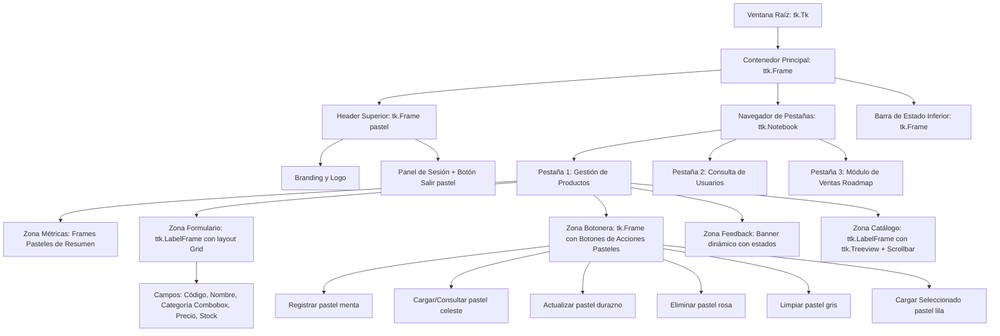

# Sistema de Restaurante Gourmet — Semana 14
## Componentes, Contenedores, Operaciones de Catálogo y Persistencia JSON en Tkinter

**Asignatura:** Programación Orientada a Objetos  
**Carrera:** Ingeniería en Tecnologías de la Información  
**Universidad:** Universidad Estatal Amazónica (UEA)  
**Estudiante:** Lilibeth Demera  
**Período Académico:** Segundo Semestre  

---

## 1. Introducción y Propósito Pedagógico

En esta **Semana 14**, el desarrollo de **restaurante_app** evoluciona a partir de la base modular y gráfica construida en la Semana 13. El objetivo fundamental de esta actividad es el **diseño y organización avanzada de interfaces gráficas mediante Componentes y Contenedores de Tkinter/ttk**, integrando operaciones de captura, consulta, actualización y eliminación de productos con persistencia en tiempo real en archivos locales (`productos.json`).

### Principios Fundamentales del Diseño:
1. **Conservación de la Arquitectura en Capas:** Se mantiene la separación estricta de responsabilidades entre `datos/`, `modelos/`, `servicios/`, `ui/` y `main.py`.
2. **Desacoplamiento Estricto de la UI:** La capa gráfica (`ui/main_view.py`) **en ningún momento manipula directamente los archivos JSON**. Todas las operaciones de validación y negocio se delegan a `RestauranteServicio`, el cual a su vez coordina la persistencia a través de `ArchivoServicio`.
3. **Uso Adecuado de Componentes y Contenedores:** Separación visual de áreas de navegación, métricas, formularios, botoneras de acción y tablas de datos mediante `Frame`, `LabelFrame`, `Notebook` y gestores de geometría `pack()` y `grid()`.
4. **Diseño Visual con Paleta de Colores Pasteles:** Se aplica un esquema visual suave, armónico y legible, transformando componentes estándar en una interfaz moderna y amigable para el usuario.
5. **Simplicidad en la Interacción:** Operaciones ejecutadas mediante botones con eventos directos (`command=`), sin sobrecargar con eventos avanzados de mouse o teclado (`bind()`, doble clic), cumpliendo a cabalidad con la pauta docente.

---

## 2. Estructura del Proyecto

```text
restaurante_app/
├── datos/
│   ├── productos.json          # Archivo local de persistencia del catálogo de productos
│   └── usuarios.json           # Archivo local con cuentas y credenciales de acceso
├── modelos/
│   ├── __init__.py             # Exporta Producto y Usuario
│   ├── producto.py             # Clase Producto (código, nombre, categoría, precio, stock)
│   └── usuario.py              # Clase Usuario (identificación, nombre, correo, clave)
├── servicios/
│   ├── __init__.py             # Exporta ArchivoServicio y RestauranteServicio
│   ├── archivo_servicio.py     # Manejo exclusivo de lectura/escritura JSON con excepciones
│   └── restaurante_servicio.py # Lógica de negocio, validaciones CRUD y delegación de persistencia
├── ui/
│   ├── __init__.py             # Exporta LoginView y MainView
│   ├── login_view.py           # Pantalla de acceso con estética pastel y validaciones visuales
│   └── main_view.py            # Panel con contenedores, formulario grid, acciones y catálogo
├── main.py                     # Configuración de estilos pasteles, ventana única y orquestación
└── README.md                   # Documentación técnica completa de la Semana 14
```

---

## 3. Jerarquía de Componentes y Contenedores Implementados

La interfaz de la **Semana 14** organiza los elementos en contenedores jerárquicos para garantizar una separación lógica y visual clara:



### Justificación de Gestores de Geometría
- **`pack()`**: Utilizado para la estructura macro (flujo vertical del Header, Notebook y Barra de estado; y flujo horizontal de las tarjetas métricas y los botones de acción).
- **`grid()`**: Empleado internamente en el formulario de producto (`form_frame`) para lograr una alineación precisa y ordenada de etiquetas (`Label`), entradas (`Entry`) y selector desplegable (`Combobox`) en filas y columnas proporcionales.

---

## 4. Paleta de Colores Pasteles Aplicada

Para satisfacer el requerimiento estético, se diseñó una paleta pastel coherente que ofrece suavidad visual sin comprometer el contraste y la legibilidad:

| Elemento / Componente | Tono Pastel (Hex) | Color de Texto / Contraste | Propósito Visual |
| :--- | :--- | :--- | :--- |
| **Barra Superior (Header)** | `#8FA4B5` (Azul pizarra pastel) | `#FFFFFF` | Identidad formal, sobria y limpia |
| **Pestañas Activas/Inactivas** | `#FFFFFF` / `#E2E8F0` | `#1E293B` / `#475569` | Navegación clara y descansada |
| **Tarjeta Métricas: Productos** | `#EDE9FE` (Lavanda suave) | `#4C1D95` | Indicador visual de volumen de catálogo |
| **Tarjeta Métricas: Stock** | `#DCFCE7` (Menta suave) | `#14532D` | Indicador visual de unidades acumuladas |
| **Tarjeta Métricas: Categorías** | `#FEF3C7` (Ámbar suave) | `#78350F` | Indicador visual de variedad gastronómica |
| **Botón ➕ Registrar** | `#A7F3D0` (Verde menta pastel) | `#065F46` | Acción positiva / creación de registro |
| **Botón 🔍 Cargar / Consultar** | `#BAE6FD` (Celeste pastel) | `#075985` | Acción de búsqueda e inspección |
| **Botón ✏️ Actualizar** | `#FED7AA` (Durazno / Melocotón) | `#9A3412` | Acción de modificación de producto |
| **Botón 🗑️ Eliminar** | `#FECDD3` (Rosa pastel) | `#9F1239` | Acción de baja con confirmación de seguridad |
| **Botón 🧹 Limpiar Campos** | `#E2E8F0` (Gris nube pastel) | `#334155` | Restablecimiento rápido del formulario |
| **Botón 📋 Cargar de Tabla** | `#E9D5FF` (Lila pastel) | `#581C87` | Facilitador de selección sin dobles clics |
| **Filas Alternadas de Tablas** | `#FFFFFF` / `#F8FAFC` | `#1E293B` | Lectura cómoda de grandes listas de registros |

---

## 5. Operaciones de Negocio y Flujo de Persistencia

Toda operación sigue el ciclo de vida desacoplado:

```text
[Interacción de Usuario en MainView]
             │ (captura de datos desde formulario/botones)
             ▼
[Invocación a RestauranteServicio]
             │ (validaciones de negocio, unicidad de código, tipos de datos)
             ▼
[Actualización de Objetos en Memoria (self._productos)]
             │
             ▼
[Invocación a ArchivoServicio.guardar_datos_productos()]
             │ (serialización atómica a JSON)
             ▼
[Persistencia en disco: datos/productos.json]
             │
             ▼
[Actualización reactiva de Treeview, Métricas y Banner en MainView]
```

### Operaciones Disponibles en la Sección de Productos:
1. **➕ Registrar Producto:**
   - Valida que el código no exista previamente en el catálogo.
   - Crea una nueva instancia de `Producto` validando código, nombre, categoría, precio $> 0$ y stock $\ge 0$.
   - Guarda los cambios en `productos.json` y refresca la tabla automáticamente.
2. **🔍 Cargar / Consultar:**
   - Permite ingresar un código en el campo correspondiente y pulsar "Cargar / Consultar".
   - `RestauranteServicio` localiza el producto y la vista rellena automáticamente los campos del formulario para su revisión o modificación.
3. **✏️ Actualizar Producto:**
   - Permite modificar el nombre, la categoría, el precio o el stock de un producto existente.
   - Valida las nuevas propiedades y actualiza el archivo `productos.json`.
4. **🗑️ Eliminar Producto:**
   - Despliega un diálogo interactivo de confirmación (`messagebox.askyesno`) para evitar borrados accidentales.
   - Elimina el producto del servicio y sincroniza inmediatamente `productos.json`.
5. **🧹 Limpiar Campos:**
   - Limpia todos los `Entry` del formulario y restablece el estado del banner de información.
6. **📋 Cargar Seleccionado de Tabla:**
   - El usuario hace clic sobre una fila del `Treeview` y pulsa este botón para poblar de inmediato el formulario sin requerir dobles clics ni atajos de teclado.

---

## 6. Credenciales de Prueba para Evaluación

El archivo `datos/usuarios.json` incluye las siguientes cuentas para acceder al sistema:

| Identificador / Correo | Contraseña | Nombre Completo | Rol Asignado |
| :--- | :--- | :--- | :--- |
| `lilibeth.d@gourmet.com` | `1234` | Lilibeth Demera | Administradora Principal |
| `juan.perez@gourmet.com` | `admin123` | Juan Pérez | Supervisor de Turno |
| `1700000003` | `gourmet2026` | María López | Jefa de Cocina |

> **Tip:** En la pantalla de login, puede presionar el botón *"Autollenar cuenta demostración"* para cargar automáticamente las credenciales principales.

---

## 7. Instrucciones de Ejecución y Comprobaciones de Funcionamiento

### 7.1. Pasos de Ejecución
1. Abra una terminal en el directorio raíz del repositorio o dentro de la carpeta de la Semana 14:
   ```bash
   cd "PARCIAL 2/SEMANA 14/restaurante_app"
   ```
2. Inicie la aplicación ejecutando:
   ```bash
   py main.py
   ```
   *(o `python main.py` de acuerdo con la configuración de su entorno).*

### 7.2. Lista de Comprobación Mínima de Funcionamiento
- [x] **Arranque y Login:** La ventana inicia centrada, con dimensiones adecuadas y estética pastel; las credenciales válidas dan paso al panel principal.
- [x] **Visualización Inicial:** El catálogo carga los 5 productos por defecto desde `productos.json` y los usuarios desde `usuarios.json`.
- [x] **Registro de Producto:** Ingrese un código nuevo (ej. `P600`), Nombre `"Risotto de Hongos"`, Categoría `"Pastas"`, Precio `16.50` y Stock `12`. Pulse `➕ Registrar`. Verifique que se añada a la tabla, aumente el contador y persista en `productos.json`.
- [x] **Carga / Consulta:** Escriba `P600` en el campo Código y pulse `🔍 Cargar / Consultar`. Compruebe que todos los campos se llenen automáticamente.
- [x] **Actualización:** Con el producto cargado, cambie el precio a `17.00` y el stock a `18`. Pulse `✏️ Actualizar`. Compruebe que la tabla refleje los nuevos datos.
- [x] **Persistencia comprobada:** Cierre la aplicación y vuelva a ejecutar `py main.py`. Confirme que las modificaciones en `P600` siguen presentes.
- [x] **Eliminación:** Cargue el producto `P600`, pulse `🗑️ Eliminar`, confirme el diálogo y verifique que desaparezca de la tabla y del archivo JSON.
- [x] **Pestaña Usuarios:** Navegue a la pestaña de usuarios y corrobore la lista de usuarios y métricas disponibles.
- [x] **Cierre de Sesión:** Pulse `🚪 Cerrar Sesión`, confirme el aviso y compruebe el retorno limpio a `LoginView`.
