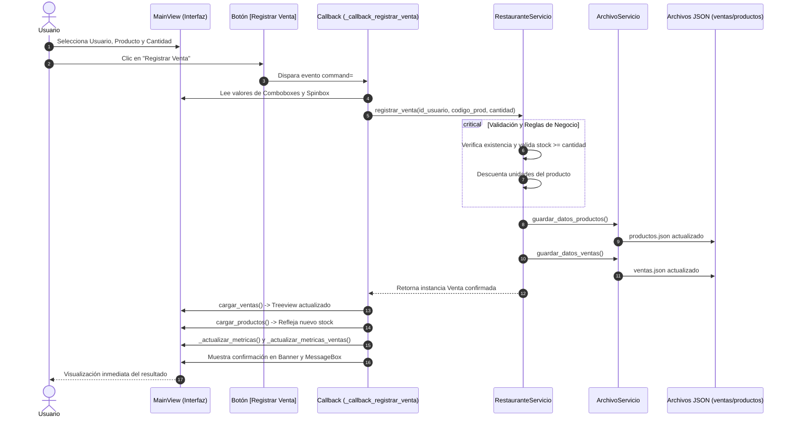

# Sistema de Restaurante Gourmet — Semana 15
## Manejo de Eventos, Callbacks y Arquitectura Transaccional de Ventas en Tkinter

**Asignatura:** Programación Orientada a Objetos  
**Carrera:** Ingeniería en Tecnologías de la Información  
**Universidad:** Universidad Estatal Amazónica (UEA)  
**Estudiante:** Lilibeth Demera  
**Período Académico:** Segundo Semestre — Parcial 2  

---

## 1. Introducción y Propósito Pedagógico

En esta **Semana 15**, el proyecto **restaurante_app** evoluciona de manera natural y progresiva a partir de la arquitectura modular consolidada en la Semana 14. El núcleo central de aprendizaje de esta entrega es la comprensión práctica y conceptual de los **Fundamentos del Manejo de Eventos** en interfaces gráficas de escritorio con Tkinter.

A diferencia de los paradigmas secuenciales tradicionales, en un sistema orientado a eventos el flujo del programa es conducido por las acciones del usuario (pulsar un botón, seleccionar un elemento de una lista o interactuar con un control). En este contexto, la **operación de venta** actúa como escenario representativo para evidenciar cómo un botón activa un **callback** mediante el parámetro `command=`, y cómo dicho callback coordina la operación delegándola a la capa de servicios sin concentrar la lógica de negocio ni la persistencia dentro de la interfaz gráfica.

### Principios Pedagógicos y de Diseño Aplicados:
1. **Conservación de la Arquitectura Existente:** No se destruyó ni reconstruyó el sistema desde cero. Se conservaron el inicio de sesión (`LoginView`), la navegación entre vistas, el catálogo y CRUD de productos, y la consulta de usuarios de semanas anteriores.
2. **Dominio Propio y Coherente:** El dominio del restaurante se mantiene intacto y adaptado (productos gastronómicos, clientes/usuarios del restaurante, inventario en unidades físicas y transacciones de ventas), sin mezclar entidades ajenas de bibliotecas o préstamos.
3. **Flujo Desacoplado de Eventos:** El callback de la interfaz solo extrae los datos de los componentes y delega la ejecución de reglas al `RestauranteServicio`.
4. **Validaciones en el Servicio:** Las reglas de negocio (existencia de entidades, stock suficiente y descuento de existencias) residen estrictamente en `RestauranteServicio`.
5. **Incorporación Obligatoria de `assets/`:** Se integran recursos visuales oficiales (logotipo del restaurante, ícono de ventana e íconos temáticos) para consolidar una identidad corporativa profesional.

---

## 2. Fundamento del Manejo de Eventos

El núcleo de la Semana 15 reside en la interacción desacoplada basada en eventos. Cuando el usuario interactúa con la aplicación, se desencadena una secuencia ordenada y predecible:

```
  USUARIO
     │
     ▼  (Selecciona cliente, producto, cantidad y hace clic)
  BOTÓN "Registrar Venta"
     │
     ▼  (Parámetro: command=self._callback_registrar_venta)
  CALLBACK (_callback_registrar_venta)
     │  - Extrae selecciones de los comboboxes y spinbox
     │  - Valida completitud visual
     ▼
  RestauranteServicio.registrar_venta(...)
     │  - Valida existencia del usuario y producto
     │  - Valida stock disponible (stock >= cantidad)
     │  - Descuenta inventario del producto
     │  - Genera ID secuencial (VEN-XXX) y marca de tiempo
     │  - Crea la instancia del modelo Venta
     ▼
  PERSISTENCIA EN ARCHIVOS JSON
     │  - ArchivoServicio.guardar_datos_productos()  -> datos/productos.json
     │  - ArchivoServicio.guardar_datos_ventas()     -> datos/ventas.json
     ▼
  RESPUESTA EN LA INTERFAZ (UI)
        - Inserción de la nueva venta en el Treeview de ventas
        - Actualización inmediata del Treeview de productos (stock reducido)
        - Actualización de las tarjetas métricas (ventas, ingresos, stock)
        - Refresco de las opciones desplegables de productos
        - Mensaje de confirmación visual en banner y diálogo informativo
```

### Diagrama Mermaid del Flujo de Eventos:



---

## 3. Estructura Modular del Proyecto

Se preserva la separación estricta de responsabilidades en capas:

```text
restaurante_app/
├── assets/                          # (Obligatorio Semana 15) Recursos gráficos e identidad
│   ├── logo.png                     # Logotipo corporativo para la pantalla de Login
│   ├── logo_header.png              # Logotipo optimizado (48x48) para el header superior
│   ├── icono_app.png                # Ícono de aplicación para barra de títulos y sistema
│   ├── icono_producto.png           # Ícono temático para módulo de productos
│   ├── icono_usuario.png            # Ícono temático para módulo de usuarios
│   └── icono_venta.png              # Ícono temático para módulo de ventas
├── datos/                           # Persistencia física en formato JSON
│   ├── productos.json               # Catálogo de alimentos, precios y existencias
│   ├── usuarios.json                # Personal registrado con credenciales de acceso
│   └── ventas.json                  # Historial persistente de transacciones realizadas
├── modelos/                         # Clases del dominio con encapsulación estricta
│   ├── __init__.py                  # Exporta Producto, Usuario y Venta
│   ├── producto.py                  # Entidad Producto (@property, @setter, serialización)
│   ├── usuario.py                   # Entidad Usuario (validación de correo y contraseña)
│   └── venta.py                     # Entidad Venta (relación usuario-producto-fecha-total)
├── servicios/                       # Capa de negocio y persistencia atómica
│   ├── __init__.py                  # Exporta ArchivoServicio y RestauranteServicio
│   ├── archivo_servicio.py          # Manejo de E/S de archivos JSON con control de excepciones
│   └── restaurante_servicio.py      # Lógica transaccional, validaciones y reglas de stock
├── ui/                              # Capa de presentación visual (Tkinter / ttk)
│   ├── __init__.py                  # Exporta LoginView y MainView
│   ├── login_view.py                # Pantalla de acceso con logotipo de assets/ y tonos pasteles
│   └── main_view.py                 # Panel principal con pestaña de Ventas y manejo de eventos
├── main.py                          # Orquestador del ciclo de vida, estilos ttk e ícono de ventana
└── README.md                        # Documentación técnica completa de la Semana 15
```

---

## 4. Evolución de Componentes y Modelos

### 4.1. Modelo `Venta` (`modelos/venta.py`)
Representa una transacción de venta que vincula al usuario que opera la transacción con el producto consumido:
- **`id_venta`:** Código identificador correlativo (ej. `VEN-001`, `VEN-002`).
- **`id_usuario`:** Cédula del cliente o usuario registrado.
- **`nombre_usuario`:** Nombre completo del cliente para auditoría y visualización.
- **`codigo_producto`:** Identificador del plato o bebida vendido.
- **`nombre_producto`:** Descripción del ítem del menú.
- **`precio_unitario`:** Tarifa unitaria congelada al momento de la venta.
- **`cantidad`:** Unidades vendidas (entero $\ge 1$).
- **`total`:** Importe calculado automáticamente (`precio_unitario * cantidad`).
- **`fecha`:** Marca de tiempo exacta (`YYYY-MM-DD HH:MM:SS`).
- Encapsulación mediante `@property` y `@setter` con métodos `to_dict()` y `from_dict()`.

### 4.2. Persistencia en `ArchivoServicio` (`servicios/archivo_servicio.py`)
- Incorpora las operaciones `cargar_datos_ventas()` y `guardar_datos_ventas()`.
- Si el archivo `datos/ventas.json` no existe al inicio, el servicio lo genera automáticamente inicializado como una lista vacía `[]`.
- La escritura se ejecuta de forma segura con codificación UTF-8 e indentación de 4 espacios.

### 4.3. Reglas de Negocio en `RestauranteServicio` (`servicios/restaurante_servicio.py`)
- Método transaccional central:
  ```python
  def registrar_venta(self, id_usuario: str, codigo_producto: str, cantidad: int = 1) -> Venta
  ```
- **Validaciones aplicadas:**
  1. Verifica que el usuario exista en la colección de usuarios.
  2. Verifica que el producto exista en el catálogo.
  3. Valida que la cantidad sea un entero válido $\ge 1$.
  4. Comprueba la disponibilidad de inventario: si `producto.stock < cantidad`, interrumpe la operación lanzando `ValueError` con el desglose exacto de existencias.
  5. Descuenta el inventario: `producto.stock -= cantidad`.
  6. Sincroniza y persiste ambos archivos en disco (`productos.json` y `ventas.json`).
  7. Retorna la venta consolidada.

---

## 5. Diseño de Interfaz y Experiencia de Usuario (UI/UX)

La interfaz gráfica mantiene la armonía visual de la Semana 14 en tonos pasteles, complementada con el uso de **recursos gráficos desde la carpeta `assets/`**:

| Elemento / Componente | Recurso / Color Aplicado | Propósito en la Experiencia de Usuario |
| :--- | :--- | :--- |
| **Ícono de Ventana** | `assets/icono_app.png` | Identidad en la barra de títulos de Windows y barra de tareas |
| **Logotipo en Login** | `assets/logo.png` | Bienvenida visualmente atractiva en la tarjeta de acceso |
| **Logotipo en Header** | `assets/logo_header.png` | Branding elegante y sobrio junto al título principal |
| **Pestaña de Ventas** | Tonos pasteles lavanda, menta y ámbar | Módulo transaccional claro y bien delimitado |
| **Selector de Usuario** | `ttk.Combobox` (solo lectura) | Selección rápida de personal/clientes registrados |
| **Selector de Producto** | `ttk.Combobox` (solo lectura) | Muestra código, nombre, precio y stock actual en vivo |
| **Control de Cantidad** | `ttk.Spinbox` con binding | Selector numérico que recalcula el total automáticamente |
| **Total Estimado en Vivo** | Etiqueta dinámica `#065F46` | Cálculo inmediato de `$ Precio × Cantidad` antes de registrar |
| **Botón 🛒 Registrar Venta** | Fondo pastel menta `#A7F3D0` | Botón protagonista vinculado mediante `command=` al callback |
| **Tabla Historial Ventas** | `ttk.Treeview` con filas alternadas | Visualización ordenada de transacciones con scrollbar |

---

## 6. Credenciales de Prueba para Evaluación

El sistema dispone de las siguientes cuentas en `datos/usuarios.json`:

| Identificador / Correo | Contraseña | Nombre Completo | Rol Asignado |
| :--- | :--- | :--- | :--- |
| `lilibeth.d@gourmet.com` | `1234` | Lilibeth Demera | Administradora Principal |
| `juan.perez@gourmet.com` | `admin123` | Juan Pérez | Supervisor de Turno |
| `1700000003` | `gourmet2026` | María López | Jefa de Cocina |

> **Nota:** La pantalla de login incluye el botón *"Autollenar cuenta demostración"* para facilitar la verificación inmediata del docente sin digitación manual.

---

## 7. Instrucciones de Ejecución y Comprobaciones

### 7.1. Pasos para Ejecutar la Aplicación
1. Abra una terminal en el directorio del proyecto:
   ```bash
   cd "PARCIAL 2/SEMANA 15/restaurante_app"
   ```
2. Ejecute el punto de entrada principal:
   ```bash
   py main.py
   ```
   *(o `python main.py` según su intérprete de Python).*

---

### 7.2. Lista de Comprobación Mínima de Funcionamiento (Semana 15)

- [x] **Arranque sin Errores:** La aplicación inicia correctamente, mostrando la pantalla centrada y el ícono corporativo cargado desde `assets/icono_app.png`.
- [x] **Inicio de Sesión y Navegación:** El acceso mediante credenciales demo o directas funciona perfectamente y conduce a `MainView`.
- [x] **Conservación de Funciones Previas:** Las pestañas de **Gestión de Productos** (CRUD, filtros, catálogo) y **Consulta de Usuarios** mantienen intactas todas sus operaciones.
- [x] **Sección Visible de Ventas:** Existe una tercera pestaña claramente rotulada `🧾 Registro y Gestión de Ventas`.
- [x] **Selección de Usuario:** El desplegable `ttk.Combobox` permite elegir cualquiera de los usuarios registrados en el sistema.
- [x] **Selección de Producto:** El desplegable `ttk.Combobox` lista los productos mostrando nombre, precio y stock actual.
- [x] **Cálculo Dinámico:** Al cambiar el producto o la cantidad en el Spinbox, el campo "Total Estimado" se actualiza automáticamente.
- [x] **Botón Registrar Venta con `command=`:** El botón utiliza el parámetro `command=self._callback_registrar_venta` para activar la transacción.
- [x] **Delegación a RestauranteServicio:** El callback no manipula archivos; delega la validación y ejecución a `RestauranteServicio.registrar_venta(...)`.
- [x] **Validación de Inventario:** Si se intenta vender una cantidad superior al stock existente, el servicio deniega la operación con un mensaje de alerta amigable y sin inconsistencias.
- [x] **Persistencia en `ventas.json` y `productos.json`:** Tras confirmar la venta, el registro se almacena en `ventas.json` y el stock del producto disminuye en `productos.json`.
- [x] **Actualización Visual Inmediata:** La venta aparece instantáneamente en el Treeview de ventas, y al volver a la pestaña de productos se observa el nuevo stock reducido.
- [x] **Recuperación tras Reinicio:** Al cerrar la aplicación y volver a iniciarla con `py main.py`, las ventas registradas persisten en el historial.
- [x] **Cero Referencias Extrañas:** No existen términos, variables ni mensajes alusivos a libros o bibliotecas; todo el vocabulario responde al restaurante gastronómico.
- [x] **Uso Obligatorio de `assets/`:** La carpeta `assets/` contiene y proporciona el logotipo, íconos y elementos gráficos integrados en la interfaz de usuario.
